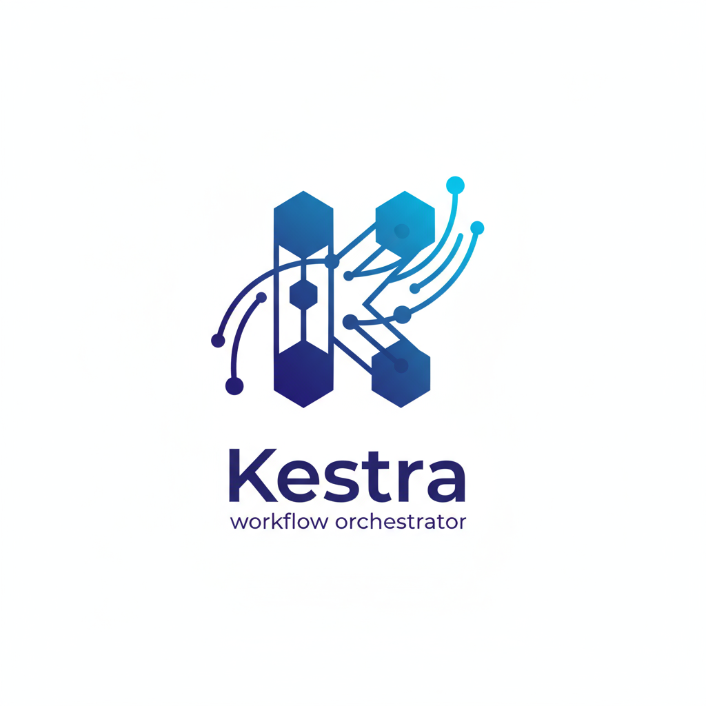
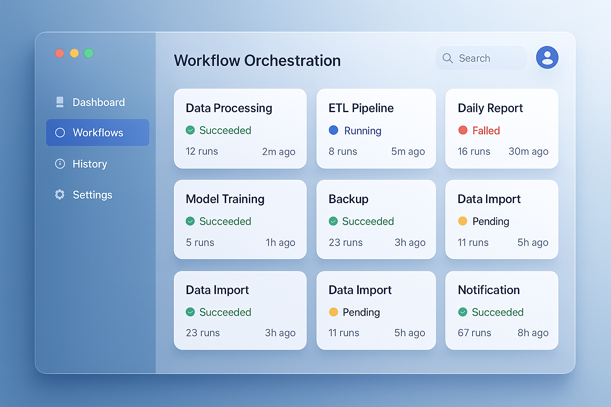

# Kestra Workflow Orchestrator

<div align="center">
  
  
  <p align="center">
    <strong>Modern workflow orchestration platform with intuitive web interface</strong>
  </p>

  <p align="center">
    <a href="#features">Features</a> •
    <a href="#demo">Demo</a> •
    <a href="#installation">Installation</a> •
    <a href="#usage">Usage</a> •
    <a href="#contributing">Contributing</a>
  </p>

  <p align="center">
    
    
    
    
    
  </p>
</div>

## Overview

Kestra Workflow Orchestrator is a modern, web-based platform for managing and monitoring complex data workflows. Built with React and featuring a professional macOS-inspired interface with liquid glass effects, it provides an intuitive way to orchestrate, schedule, and monitor your data pipelines.



## Features

### 🎯 **Workflow Management**
- **Visual Dashboard**: Real-time overview of all workflows with status indicators
- **Workflow Cards**: Clean, organized display of workflow information
- **Status Tracking**: Live monitoring of running, completed, failed, and scheduled workflows
- **Performance Metrics**: Success rates, execution times, and historical data

### 🎨 **Modern Interface**
- **Liquid Glass Design**: Professional macOS-inspired UI with translucent effects
- **Responsive Layout**: Optimized for desktop, tablet, and mobile devices
- **Dark Mode Support**: Automatic theme switching based on system preferences
- **Smooth Animations**: Fluid transitions and micro-interactions

### 📊 **Analytics & Monitoring**
- **Real-time Statistics**: Live workflow execution metrics
- **Historical Data**: Trend analysis and performance tracking
- **Success Rate Monitoring**: Track workflow reliability over time
- **Resource Usage**: Monitor data processing and execution times

### 🔌 **Plugin Ecosystem**
- **Database Connectors**: PostgreSQL, MySQL, MongoDB, and more
- **Cloud Storage**: AWS S3, Google Cloud Storage, Azure Blob
- **Message Queues**: Apache Kafka, RabbitMQ, Redis
- **API Integrations**: REST APIs, GraphQL, webhooks

## Demo

🚀 **[Live Demo](https://kestra-orchestrator.vercel.app)**

Experience the full functionality of Kestra Workflow Orchestrator with our interactive demo. No installation required!

## Installation

### Prerequisites

- Node.js 18.0 or higher
- npm or pnpm package manager

### Quick Start

```bash
# Clone the repository
git clone https://github.com/x0VIER/kestra-workflow-orchestrator.git

# Navigate to project directory
cd kestra-workflow-orchestrator

# Install dependencies
npm install

# Start development server
npm run dev
```

The application will be available at `http://localhost:5173`

### Production Build

```bash
# Build for production
npm run build

# Preview production build
npm run preview
```

## Usage

### Dashboard Overview

The main dashboard provides a comprehensive view of your workflow ecosystem:

- **Workflow Cards**: Each workflow is displayed as a card showing status, last run time, and success rate
- **Quick Actions**: Start, stop, or configure workflows directly from the dashboard
- **Search & Filter**: Find specific workflows using the search functionality
- **Real-time Updates**: Live status updates without page refresh

### Workflow Management

#### Creating Workflows

1. Click the "New Workflow" button in the header
2. Define your workflow steps and dependencies
3. Configure scheduling and retry policies
4. Save and activate your workflow

#### Monitoring Execution

- View real-time execution status
- Access detailed logs and error messages
- Monitor resource usage and performance metrics
- Set up alerts for failed executions

### Plugin Configuration

Navigate to the Plugins tab to:

- Browse available integrations
- Install new plugins from the marketplace
- Configure connection settings
- Manage plugin versions and updates

## Configuration

### Environment Variables

Create a `.env` file in the root directory:

```env
# API Configuration
VITE_API_BASE_URL=http://localhost:8080
VITE_WS_URL=ws://localhost:8080/ws

# Authentication
VITE_AUTH_ENABLED=true
VITE_AUTH_PROVIDER=oauth2

# Feature Flags
VITE_ENABLE_DARK_MODE=true
VITE_ENABLE_ANALYTICS=true
```

### Customization

The interface can be customized through the configuration file:

```javascript
// src/config/app.config.js
export const appConfig = {
  theme: {
    primaryColor: '#3b82f6',
    accentColor: '#6366f1',
    borderRadius: '12px'
  },
  features: {
    darkMode: true,
    animations: true,
    notifications: true
  }
}
```

## API Integration

Kestra Workflow Orchestrator integrates with the Kestra API for backend functionality:

```javascript
// Example API usage
import { kestraApi } from './api/kestra'

// Fetch workflows
const workflows = await kestraApi.getWorkflows()

// Start workflow execution
await kestraApi.executeWorkflow(workflowId, parameters)

// Get execution status
const status = await kestraApi.getExecutionStatus(executionId)
```

## Development

### Project Structure

```
kestra-workflow-orchestrator/
├── src/
│   ├── components/          # Reusable UI components
│   ├── pages/              # Page components
│   ├── hooks/              # Custom React hooks
│   ├── api/                # API integration
│   ├── utils/              # Utility functions
│   └── styles/             # Global styles
├── public/                 # Static assets
└── docs/                   # Documentation
```

### Development Guidelines

- Follow React best practices and hooks patterns
- Use TypeScript for type safety
- Implement responsive design principles
- Write comprehensive tests for components
- Follow the established code style and formatting

### Testing

```bash
# Run unit tests
npm run test

# Run integration tests
npm run test:integration

# Generate coverage report
npm run test:coverage
```

## Deployment

### Vercel (Recommended)

```bash
# Install Vercel CLI
npm i -g vercel

# Deploy to Vercel
vercel --prod
```

### Docker

```bash
# Build Docker image
docker build -t kestra-orchestrator .

# Run container
docker run -p 3000:3000 kestra-orchestrator
```

### Manual Deployment

```bash
# Build for production
npm run build

# Deploy dist/ folder to your hosting provider
```

## Performance

- **Bundle Size**: < 500KB gzipped
- **Load Time**: < 3 seconds on 3G connection
- **Lighthouse Score**: 95+ (Performance, Accessibility, Best Practices)
- **Browser Support**: Chrome 90+, Firefox 88+, Safari 14+, Edge 90+

## Contributing

We welcome contributions from the community! Please read our [Contributing Guidelines](CONTRIBUTING.md) before submitting pull requests.

### Development Setup

1. Fork the repository
2. Create a feature branch (`git checkout -b feature/amazing-feature`)
3. Make your changes
4. Add tests for new functionality
5. Commit your changes (`git commit -m 'Add amazing feature'`)
6. Push to the branch (`git push origin feature/amazing-feature`)
7. Open a Pull Request

### Code Style

- Use Prettier for code formatting
- Follow ESLint rules
- Write meaningful commit messages
- Add JSDoc comments for functions

## Roadmap

- [ ] **Advanced Scheduling**: Cron expressions and complex scheduling rules
- [ ] **Workflow Templates**: Pre-built templates for common use cases
- [ ] **Team Collaboration**: Multi-user support and role-based access
- [ ] **Advanced Analytics**: Custom dashboards and reporting
- [ ] **Mobile App**: Native mobile application for monitoring
- [ ] **API Gateway**: Built-in API management and documentation

## Support

- **Documentation**: [docs.kestra-orchestrator.com](https://docs.kestra-orchestrator.com)
- **Issues**: [GitHub Issues](https://github.com/x0VIER/kestra-workflow-orchestrator/issues)
- **Discussions**: [GitHub Discussions](https://github.com/x0VIER/kestra-workflow-orchestrator/discussions)
- **Email**: support@kestra-orchestrator.com

## License

This project is licensed under the MIT License - see the [LICENSE](LICENSE) file for details.

## Acknowledgments

- **React Team** - For the amazing React framework
- **Tailwind CSS** - For the utility-first CSS framework
- **Framer Motion** - For smooth animations and transitions
- **Lucide** - For beautiful icons
- **Vercel** - For seamless deployment platform

---

<div align="center">
  <p>Made with ❤️ by the development team</p>
  <p>
    <a href="https://github.com/x0VIER/kestra-workflow-orchestrator">⭐ Star this project</a> •
    <a href="https://github.com/x0VIER/kestra-workflow-orchestrator/issues">🐛 Report Bug</a> •
    <a href="https://github.com/x0VIER/kestra-workflow-orchestrator/issues">💡 Request Feature</a>
  </p>
</div>
